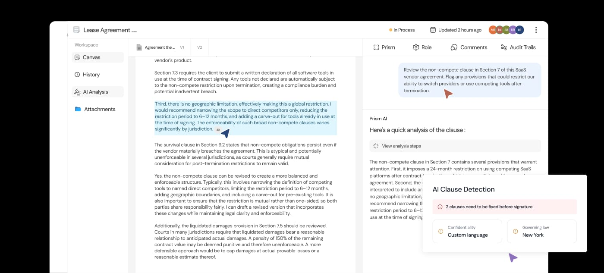
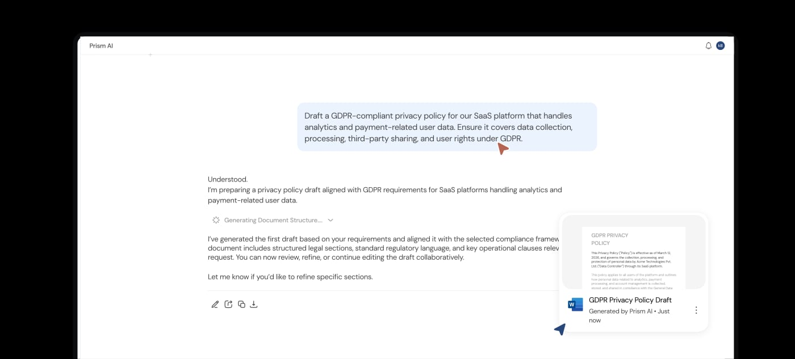
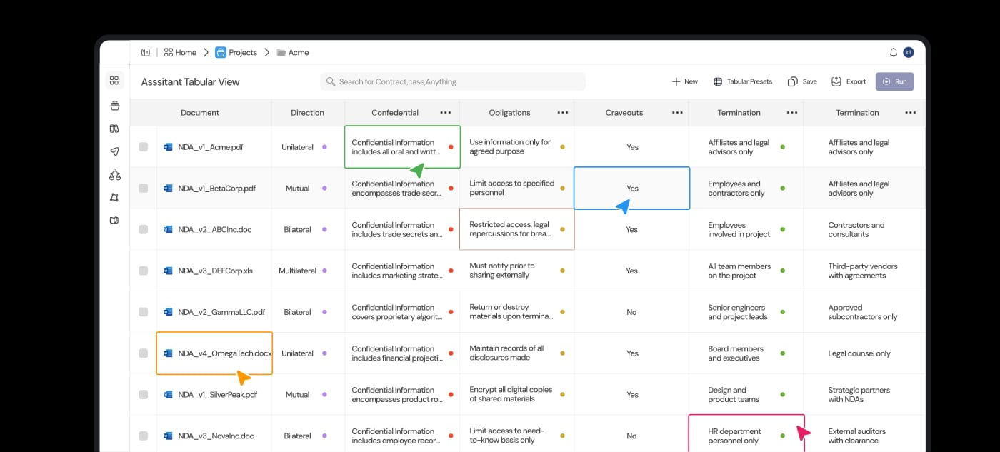
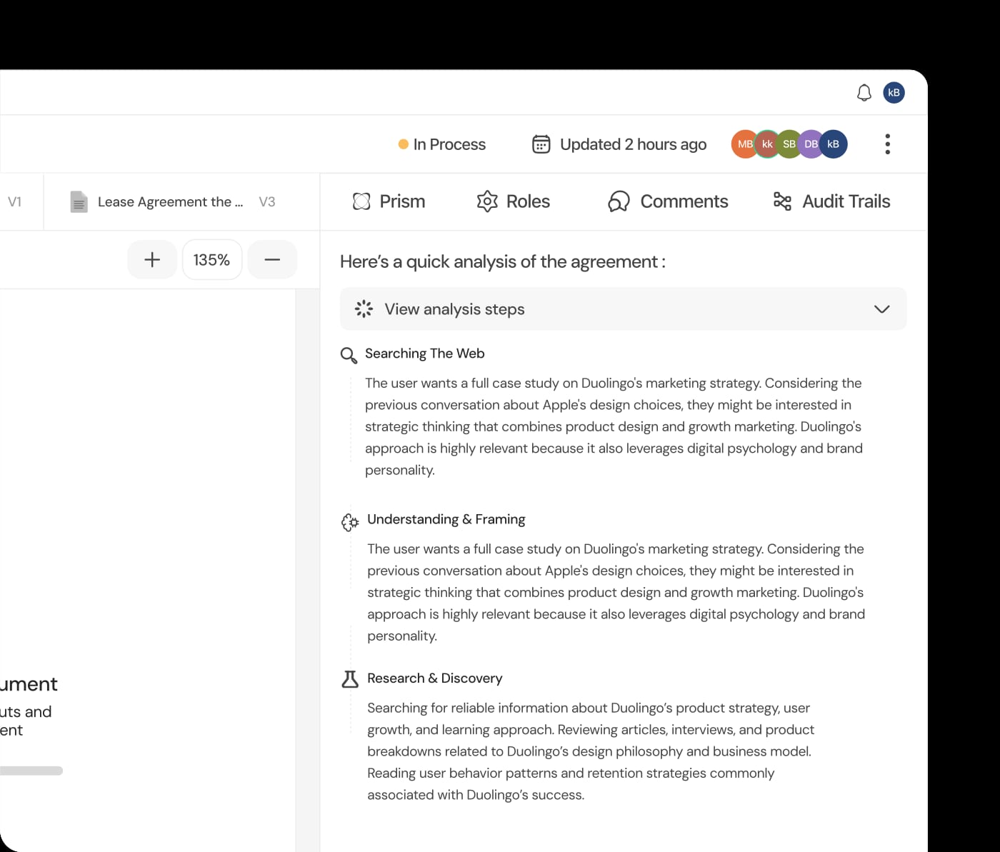

<h1 align="center">
  <a href="https://prism.futurixai.com/">
    <picture>
      <source media="(prefers-color-scheme: dark)" srcset="docs/assets/prism-lockup-dark.gif">
      <source media="(prefers-color-scheme: light)" srcset="docs/assets/prism-lockup-light.gif">
      
    </picture>
  </a>
</h1>

<p align="center"><strong>The open-source command centre for legal teams.</strong></p>

<p align="center">
  One legal OS to draft, review, and take command of every contract.<br>
  Host it yourself, or have FuturixAI run it for you.
</p>

<p align="center">
  <a href="https://github.com/FuturixAI-and-Quantum-Works/Prism/actions/workflows/ci.yml"></a>
  <a href="LICENSE"></a>
  
  
</p>

<p align="center">
  <a href="https://prism-legal-os-site-ohzg.vercel.app/">Product site</a> ·
  <a href="#features">Features</a> ·
  <a href="#quick-start">Quick start</a> ·
  <a href="./ARCHITECTURE.md">Architecture</a> ·
  <a href="docs/deployment.md">Deployment</a> ·
  <a href="mailto:connect@futurixai.com">Enterprise</a>
</p>

---

Prism is an open-source contract litigation management system for drafting, reviewing, sharing, and managing legal work. Luna is the AI assistant inside Prism. The browser application uses React and Vite. The API uses Express, Better Auth, PostgreSQL, and Drizzle ORM.

Legal work is still too fragmented. Teams draft documents, review contracts, compare versions, check compliance, and manage negotiations across different tools. Prism brings that work together in one connected workspace.

## Platform preview

Product screenshots from the [Prism Legal OS site](https://prism-legal-os-site-ohzg.vercel.app/).

### Workspace

Review documents, work together, and keep every clause in context.



### Prism AI

Research, draft, and refine legal documents with your AI assistant.



### Contract Intelligence

Compare documents side by side and bring the details that matter into view.



### Document Intelligence

Analyze legal documents with speed and precision. Extract clauses, obligations, risks, key entities, and critical information from contracts, policies, and legal documents in seconds.



## Features

Draft faster. Check smarter. Work better. Start with a template or a request to Luna, bring your documents into a shared workspace, and move drafts through review and approval. Explore the [feature guide](./features/README.md) for workflows, examples, and setup requirements.

| Feature                                                                             | What you can do                                                                                                                                                          |
| ----------------------------------------------------------------------------------- | ------------------------------------------------------------------------------------------------------------------------------------------------------------------------ |
| [Shared legal workspaces](./features/workspaces/README.md)                          | Bring primary and supporting documents into a shared legal workspace. Organize agreements, versions, and collaborators with role-based access.                           |
| [AI-powered drafting and document assistance](./features/ai-drafting/README.md)     | Research, draft, and refine legal documents with Luna. Ask questions about your files and inspect supporting source references.                                          |
| [61 contract and legal-document templates](./features/contract-templates/README.md) | Start with a legal template and refine your draft with Luna. Use 54 Word and seven HTML templates with guided fields.                                                    |
| [Multi-document tabular review](./features/tabular-review/README.md)                | Extract and compare key terms across multiple documents in a configurable review table.                                                                                  |
| [AI-assisted contract review](./features/contract-review/README.md)                 | Identify legal risks before they become problems. Spot missing clauses, compliance gaps, conflicting terms, and potential risks with supporting context.                 |
| [Custom review playbooks](./features/review-playbooks/README.md)                    | Check contracts against your team's review playbooks. Keep review criteria consistent across matters.                                                                    |
| [Document editing and version history](./features/document-editor/README.md)        | Edit clauses, resolve comments, and keep a history of every version. Export Word or PDF documents ready for the next step.                                               |
| [Collaborative review and approvals](./features/review-and-approvals/README.md)     | Bring the whole team into the conversation. Discuss clauses, share feedback, resolve comments, and approve or reject drafts with activity history.                       |

### Legal workflow

All your legal work, one connected workspace:

1. **Organize.** Bring primary and supporting documents into a shared legal workspace.
2. **Research.** Explore your sources with AI-assisted answers and supporting references.
3. **Draft.** Start with a legal template and refine your draft with Luna.
4. **Analyze.** Extract and compare key terms across multiple documents.
5. **Review.** Check contracts against your team's review playbooks.
6. **Refine.** Edit clauses, resolve comments, and keep a history of every version.
7. **Approve.** Bring your team together to review and approve the final draft.
8. **Export.** Export your document in Word or PDF, ready for the next step.

AI features require a configured provider. Indexed source retrieval also requires Qdrant and an OpenAI key, and background analysis requires the worker. Each feature guide explains its prerequisites. AI output and templates need qualified legal review before use.

> [!IMPORTANT]
> **Deploy on your terms**
>
> **Self-hosted:** your infrastructure, your control. Get the source, customize Prism, and run it wherever you choose.
> **Managed by FuturixAI:** we deploy, maintain, and run Prism for your team. You focus on legal work.
>
> For private infrastructure, custom integrations, migration support, or managed rollouts, contact [connect@futurixai.com](mailto:connect@futurixai.com).

## What runs

The repository has three application processes and two data services:

- [`frontend/`](frontend/) contains the React 19 and Vite 8 single-page application.
- [`backend/src/index.ts`](backend/src/index.ts) starts the Express API.
- [`backend/src/worker.ts`](backend/src/worker.ts) processes PostgreSQL-backed jobs and email outbox events.
- PostgreSQL 16 stores application data, Better Auth records, queues, and outbox events.
- Qdrant stores the document search index.

The shared event contract lives in [`packages/protocol/`](packages/protocol/). Uploaded and generated files live in an S3-compatible object store. Compose runs MinIO for it, and host development can use local files.

## Quick start

Install Docker Engine with Docker Compose. You need a [Resend](https://resend.com/) API key for sign-in email. An [OpenAI](https://platform.openai.com/) API key enables Luna and document search.

```sh
git clone https://github.com/FuturixAI-and-Quantum-Works/Prism.git
```

Run the remaining commands from the new `Prism` directory.

```sh
cp .env.example .env
```

Set `RESEND_API_KEY` and `OPENAI_API_KEY` in `.env`, then start Prism.

```sh
docker compose up -d
```

Open `http://localhost:8080` and sign in with your email address. The six-digit sign-in code arrives by email through Resend.

The default sender, `onboarding@resend.dev`, delivers only to the email address of your Resend account. To invite other people, set `MAIL_FROM` in `.env` to an address on a domain you have verified in Resend, then run `docker compose up -d` again.

Compose starts PostgreSQL, Qdrant, MinIO, the API, the worker, and the frontend. MinIO stores uploaded and generated files in the `prism` bucket, which Compose creates on first start. The backend container runs migrations automatically before it starts the API. It also seeds approval policies, workflows, the AI model catalog, and all 61 bundled templates. Prism generates its application secrets on first start and keeps them in the `prism_secrets` volume.

The API listens on `http://localhost:8003`, with API documentation at `http://localhost:8003/api-docs`. To grant an existing account the global administrator role, run:

```sh
docker compose exec backend node dist/scripts/seedAdmin.js --email admin@example.com
```

Stop Prism without deleting data:

```sh
docker compose down
```

Adding `-v` deletes the database, stored files, search index, and generated secrets.

## Develop Prism on the host

Install Node.js 22.x, npm 11.19.0, and Docker Engine with Docker Compose. Install LibreOffice if you need DOC or DOCX to PDF conversion. Puppeteer installs its Chromium build with the normal dependency install.

Complete the `.env` step from the quick start, then run:

```sh
npm ci
docker compose up -d postgres qdrant
cp backend/.env.example backend/.env
npm run setup --workspace @prism/backend
npm run dev
```

`setup` builds the backend, applies migrations, and runs every seed. Rerun it after you pull new migrations. The backend generates its secrets into `backend/.secrets.env` on first start.

Open `http://localhost:5173`. The API listens on `http://localhost:3001`. The worker does not open a network port.

The baseline at [`backend/drizzle/0000_prism_baseline.sql`](backend/drizzle/0000_prism_baseline.sql) is for a new database. Do not apply it over a private database created before the baseline. Use the [pre-baseline database migration guide](docs/pre-baseline-database-migration.md).

## Know the default behavior

- Luna uses the server OpenAI connection when `OPENAI_API_KEY` is set. Users can add their own Anthropic, Google, OpenAI, and OpenAI-compatible connections under **Settings > AI settings**.
- Document search needs Qdrant and `OPENAI_API_KEY`. Compose runs Qdrant for you. Without both, uploads still work, but source indexing and source-backed search do not.
- Storage uses MinIO under Compose and the local filesystem for host development. Production requires S3-compatible storage and rejects local storage.
- Without `RESEND_API_KEY`, mail records delivery as suppressed and does not expose email contents or sign-in codes.
- DOC and DOCX conversion uses LibreOffice. HTML to PDF conversion uses Puppeteer Chromium.
- The worker handles document indexing, compliance runs, tabular generation, email delivery, health checks, and storage reconciliation.

Read [provider setup](docs/providers.md) and [deployment operations](docs/deployment.md) for the complete configuration.

## Run the checks

Run the documentation check first.

```sh
node scripts/check-docs.mjs
```

Run the publication blocker scan.

```sh
npm run check:publication
```

Run the full local CI sequence.

```sh
npm run ci
```

The full sequence verifies the publication rules, authentication migration guard, database baseline, seed data, formatting, lint, types, unit and security tests, production dependency audit, builds, and mocked browser journeys.

## Read the documentation

### Tutorials

- The [quick start](#quick-start) runs Prism with Docker Compose.

### How-to guides

- [Contribute to Prism](./CONTRIBUTING.md).
- [Report and handle security issues](./SECURITY.md).
- [Configure AI providers](docs/providers.md).
- [Back up and restore Prism](docs/backups-and-restore.md).
- [Move a pre-baseline private database](docs/pre-baseline-database-migration.md).
- [Deploy and operate Prism](docs/deployment.md).

### Reference

- [Template packs, jurisdictions, and licensing](docs/template-catalog.md).
- [Bundled DOCX license and redistribution permission](docs/template-license.md).
- [Frontend design system](./frontend/DESIGN_SYSTEM.md).

### Explanation

- [Prism architecture](./ARCHITECTURE.md).

## 💪 Thanks to our Contributors

See our contributors list in [CONTRIBUTORS.md](./CONTRIBUTORS.md). You can also view the full list of [contributors tracked by GitHub](https://github.com/FuturixAI-and-Quantum-Works/Prism/graphs/contributors).

<p>
  <a href="https://github.com/Absk-tiwari" title="Abhishek Tiwari (@Absk-tiwari)">
    
  </a>
  <a href="https://github.com/Aqua-123" title="Aqua (@Aqua-123)">
    
  </a>
  <a href="https://github.com/Hloabhi" title="Abhishek Singh (@Hloabhi)">
    
  </a>
  <a href="https://github.com/Pratoosh-18" title="Pratoosh Garg (@Pratoosh-18)">
    
  </a>
  <a href="https://github.com/rudransh2004" title="Rudransh Agnihotri (@rudransh2004)">
    
  </a>
  <a href="https://github.com/UjjwalPasahan" title="Ujjwal Pasahan (@UjjwalPasahan)">
    
  </a>
  <a href="https://github.com/YashDuhan" title="Yash Duhan (@YashDuhan)">
    
  </a>
</p>

## License and hosted modifications

Prism is licensed under [GNU Affero General Public License version 3 only](LICENSE). If you modify Prism and let users interact with that modified version over a network, section 13 requires you to offer those users the Corresponding Source of the running version at no charge through a standard method. Sections 4 through 6 also contain notice and source requirements for distribution.

The application does not add a source-code link for an operator. A host of a modified version must provide an appropriate source offer that matches the deployed version. Keep the license and notices with redistributed copies.

This paragraph summarizes repository obligations. It is not legal advice. Read the license and ask qualified counsel how it applies to your deployment.
